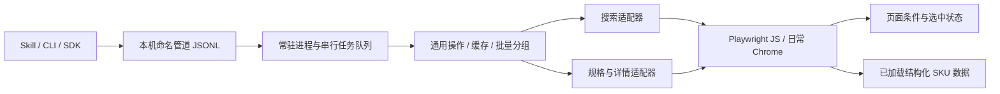

# 常驻 Playwright JavaScript 架构

三个公开业务操作为 `search(keyword)`、`getSpecs(itemId)` 和 `getDetail(itemId, spec)`。它们由一个常驻 Node 进程执行；短命的 CLI 只解析参数、提交任务、接收结果。

## 进程和连接

服务绑定当前项目和用户的 Windows 命名管道；Linux/macOS 使用本机 socket。运行信息与随机 IPC 令牌写入 `.runtime/`，不放进命令或商品输出。

服务启动后延迟连接 Chrome：第一个业务任务建立 CDP 连接，后续任务复用。使用 `noDefaults: true`，不覆盖日常浏览器的下载、媒体或焦点模拟设置。断线时重新连接；`stop` 只断开客户端，不关闭用户的默认 context、Chrome 或现有标签。

服务创建一个搜索标签及最多三个自己的商品标签。商品标签按商品 ID 复用，超过容量只回收服务自己创建的最旧标签。操作前切到对应标签，避免日常 Chrome 禁用焦点模拟时，后台标签的点击稳定性等待被暂停。

命令提交后立即得到 jobId；服务输出进度并在完成后返回结果。CLI 退出不会结束常驻进程；连接意外断开时任务结果仍保留，可用 `job <jobId>` 查询。所有浏览器操作串行，避免多个任务争用规格状态。

## 批量执行

批量支持关键词，以及商品 ID 加一组规格。也支持显式任务数组。服务把同一商品的查询集中执行，结果数组按原提交顺序恢复。搜索共用搜索标签；一个商品只打开一次，连续选择其规格。

批量中的强制刷新在该商品的首次查询执行一次；后续规格共用这份新快照。正常结果缓存默认 60 秒。过期商品快照在新查询开始前刷新；同一批次的一组连续规格共享观察时间，不在中间反复重载页面。

## 条件等待与价格证据

使用 `waitForFunction` 等待可识别列表、规格面板、目标选中状态和价格数据，每 100ms 检查一次；没有固定等待 1–1.2 秒的动作。返回少于列表 limit 时，等待内容指纹不再变化 200ms，以免返回尚未填充的卡片。

价格优先使用页面已经加载的 **真实 SKU ID → 价格记录**；不请求私有 HTTP 签名接口。被动读取当前商品的已加载 JSON / MTOP 响应，按商品 ID 归属过滤，再按 SKU 匹配。每份输出只取必要业务字段。

没有结构化 SKU 价格时，等待页面确认选中完整规格、价格变化且不处于加载状态；保留短时间的内容稳定条件。若不同规格同价且页面没有可识别的绑定/更新信号，返回 `SKU_PRICE_UNCONFIRMED`，不会用旧价格冒充核验成功。商品起价、区间价以及 `sku2info["0"]` 不作为某个规格报价。

## 登录与验证

遇到登录/验证时，服务保留当前关键词、商品和规格，进入人工等待。人工操作结束后恢复失败的查询；手动等待不计入商品数据超时。默认不限时，可用 `--manual-timeout` 设置上限，或在启动时用 `--no-wait` 直接返回状态。

Cookie 不导出、不写入项目，也不由 skill 传入。Chrome 自身保留登录。连接许可与淘宝登录分别处理，日常 Chrome 重启后可能需要新的连接许可。

## Skill 的边界

发布 Skill 只有 SKILL.md 与自包含 taobao.js。Windows 内置 PowerShell 流式加载 JS 首行入口，校验并解压内嵌 Node、Playwright、业务 bundle 和便携 Chromium，然后调用同一 CLI。应用和进程路径通过仅对子进程生效的配置注入，不引用开发项目或系统 Node。常驻进程仍负责所有浏览器操作。任务执行会话尚未完成时，调用方继续等待原会话；同商品多规格用批量输入。

只发布 Windows 11 x64；用户无需 npm 或额外运行环境。缓存位于 LOCALAPPDATA/TaobaoSearch，按 payload SHA-256 分版本；并发首次运行用用户会话 mutex 保护，先完整校验再原子移动到可运行目录。JS 约 311 MiB，内置浏览器造成大部分体积。PowerShell 加载器避免 JScript 对大文件的限制。详见 [分发说明](distribution.md)。

实现依据：[Playwright CDP 与 noDefaults](https://playwright.dev/docs/api/class-browsertype#browser-type-connect-over-cdp)、[Playwright 条件等待](https://playwright.dev/docs/api/class-page#page-wait-for-function)。淘宝适配器的当前可用性由真实验收记录支持，不能由模拟测试推断所有商品页面都兼容。
